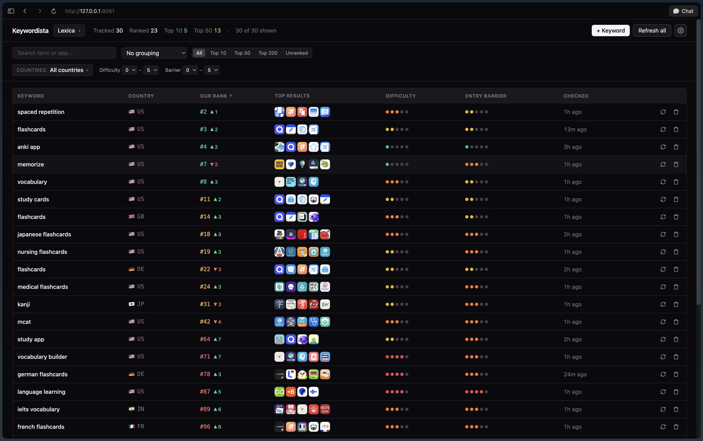

# Keywordista - App Store keyword tracker for indie iOS developers

[](https://github.com/bootuz/keywordista/actions/workflows/ci.yml)
[](https://github.com/bootuz/keywordista/actions/workflows/release-app.yml)
[](https://github.com/bootuz/keywordista/actions/workflows/release-service.yml)
[](https://github.com/bootuz/keywordista/actions/workflows/release-image.yml)
[](LICENSE)
[](#install)

Tracks where your apps rank for a set of keywords across any of Apple's 175 App Store storefronts, snapshots the top results, and remembers everything — so you can see real ASO trends instead of guessing from this-week-only screenshots. A daily chart-position watchdog fires a browser notification the moment one of your apps enters, moves in, or exits a top-free category chart anywhere it's published. Runs entirely on your Mac: a Vapor service stores history in SQLite, a Svelte dashboard renders it, and a menu-bar app supervises the whole thing. You own the data and the schedule — no $50/mo subscription, no abandoned web app, no spreadsheet that goes stale within a week.



---

## Install

> macOS 13+.

<!-- LATEST_DMG_BEGIN -->
**Download the latest DMG:** [Keywordista-0.6.0.dmg](https://github.com/bootuz/keywordista/releases/download/app-v0.6.0/Keywordista-0.6.0.dmg) (signed + notarized). Drag `Keywordista.app` into `/Applications` and launch — a magnifying-glass icon appears in your menu bar.
<!-- LATEST_DMG_END -->

Click **Open Dashboard** → the browser opens `http://127.0.0.1:8080/` (auto-picks `:8081…:8090` if `:8080` is taken). For other versions, see [all releases](https://github.com/bootuz/keywordista/releases?q=app-v).

### Build from source

If you want to hack on it, you'll also need Swift 5.10+ and Node 20+ (CI builds on Node 24).

```bash
git clone https://github.com/bootuz/keywordista.git
cd keywordista
make open-mac-app
```

Prefer no menu-bar app? Run `./keywordista` to `exec` the Vapor server in the foreground at `:8080`, with data in `./db.sqlite` instead of `~/Library/Application Support/Keywordista/`.

---

## Deploy for your team

Solo on a Mac is the canonical path, but Keywordista also publishes a single configurable Docker image so a studio of 2–10 devs can self-host it on any server they like — Render, Fly.io, a $4/mo Hetzner VPS, a Kubernetes cluster, a Nomad job, a Raspberry Pi. One team per deployment, no SaaS, no subscription, the data lives in their database forever.

The quickest path is raw Docker:

```bash
docker run -d \
  --name keywordista \
  -p 8080:8080 \
  -v keywordista-data:/data \
  -e KEYWORDISTA_ENCRYPTION_KEY=$(openssl rand -hex 32) \
  -e KEYWORDISTA_PUBLIC_BASE_URL=https://keywordista.example.com \
  ghcr.io/bootuz/keywordista:latest
```

Bootstrap your admin with `docker exec -it keywordista keywordista createsuperuser`, then log in and invite teammates from inside the dashboard. The image is signed with cosign + carries SLSA-3 provenance; verification commands and the full env-var contract are documented below.

Reference deploy manifests live in [`deploy/`](deploy/):

- [`deploy/docker-compose.yml`](deploy/docker-compose.yml) — VPS / homelab, optional Postgres + Caddy auto-TLS + Litestream backup
- [`deploy/render.yaml`](deploy/render.yaml) — Render Blueprint (~$7/mo)
- [`deploy/fly.toml`](deploy/fly.toml) — Fly.io app (free tier viable)
- [`deploy/kubernetes/`](deploy/kubernetes/) — Deployment + Service + PVC + Ingress
- [`deploy/nomad/`](deploy/nomad/) — Nomad job spec

Docs:

- [`docs/deploy/raw-docker.md`](docs/deploy/raw-docker.md) — minimum-viable `docker run`, supply-chain verification, upgrades, backups
- [`docs/env-vars.md`](docs/env-vars.md) — full env-var contract reference
- [`docs/architecture/image-contract.md`](docs/architecture/image-contract.md) — what the image promises (SemVer, backcompat policy)
- [`docs/architecture/exit-codes.md`](docs/architecture/exit-codes.md) — non-zero exit reference for ops debugging

The cockpit's in-Mac "Deploy to a server…" flow (shipping later) automates all of this from the menubar app — pick a provider, paste an API token, wait 90 seconds. Until then, the manifests above are the canonical reference.

---

## How it works

```
                           ┌──────────────────────────────────┐
                           │ Keywordista.app  (menubar shell) │
                           │ ─ Picks a free port (8080–8090)  │
                           │ ─ Spawns + supervises the server │
                           └────────────┬─────────────────────┘
                                        │
                                        ▼
              ┌──────────────────────────────────────────────────┐
              │ Vapor server (Swift, 127.0.0.1 only)             │
              │ ├ REST API under /api/v1                         │
              │ ├ Static Svelte SPA on /                         │
              │ ├ Keyword refresh    @ 03:00 UTC (Queues)        │
              │ └ Chart watchdog     @ 04:00 UTC (Queues)        │
              └───────┬──────────────────────────┬───────────────┘
                      ▼                          ▼
            ┌──────────────────┐   ┌──────────────────────────────┐
            │ SQLite (Fluent)  │   │ Apple iTunes endpoints       │
            │ + append-only    │   │ ─ /search   (keyword rank)   │
            │   rank history   │   │ ─ /lookup   (app metadata)   │
            │ + chart_event    │   │ ─ /rss/topfreeapplications   │
            │   audit log      │   │   (chart-watchdog source)    │
            └──────────────────┘   └──────────────────────────────┘
                      │
                      ▼
            SPA polls /chart-events ──► new Notification(...)
```

- **Append-only history.** Each refresh writes a `RankCheck` row. Consecutive identical observations dedupe into a single row with `firstSeenAt`/`checkedAt` so stable ranks don't bloat the DB but the timeline still tells you exactly when something changed.
- **Storefront-aware everywhere.** [Apple's 175-territory list](web/src/lib/countries.ts) is the source of truth. The *Add keyword* modal picks countries from a searchable multi-select with chips; the chart watchdog uses [per-app availability probing](Sources/App/Services/AvailabilityProber.swift) so it only polls storefronts where each app actually ships.
- **Chart-position watchdog.** Daily poll of Apple's free RSS top-free feed for each watched app's primary genre. Emits `entered` / `moved` / `exited` events ([Sources/App/Services/ChartTrackerService.swift](Sources/App/Services/ChartTrackerService.swift)); a browser-side polling loop fires `new Notification(...)` when something happens. Silent until something actually charts — most days are empty, which is correct.
- **No auth, polite worker.** Server binds to `127.0.0.1` only — anything that could reach it can already read the SQLite file directly. One job at a time, ~1 req/sec to iTunes; well below Apple's edge-throttling threshold.

---

## Dev workflow

```bash
make help          # full target catalog
make dev-backend   # Vapor on :8080
make dev-web       # Vite on :5173 (proxies /api → :8080)
swift test         # Swift Testing suite
cd web && npm run check    # svelte-check + tsc
```

Three layers: the Vapor server in `Sources/App/`, the Svelte 5 + Tailwind SPA in `web/`, and the SwiftUI `MenuBarExtra` app in `mac/`. Build outputs land in `Public/` (SPA) and `mac/Keywordista.app/` (menu-bar bundle).

Cutting a signed + notarized DMG: see [`.github/RELEASING.md`](.github/RELEASING.md). Tagged pushes (`app-v*`, `service-v*`) run the same release flow in CI.

---

## API surface

Everything under `/api/v1`. No auth, `127.0.0.1`-only. Five categories: **apps**, **keywords**, **dashboard**, **charts**, **settings**.

<details>
<summary>Full endpoint table</summary>

| Method | Path | What |
|---|---|---|
| `GET` | `/health` | Liveness probe (the menu-bar app pings this) |
| `POST` | `/apps` | Add a watched app — `{ appStoreId, lookupCountry }` |
| `GET` | `/apps` | List watched apps |
| `DELETE` | `/apps/:id` | Remove an app (cascades history) |
| `POST` | `/apps/:id/availability/refresh` | Re-probe a single app's 175 storefronts |
| `POST` | `/keywords` | Add a tracked keyword — `{ term, countryCode }` |
| `GET` | `/keywords` | List keywords |
| `DELETE` | `/keywords/:id` | Remove a keyword (cascade) |
| `POST` | `/keywords/:id/refresh` | Enqueue one immediate refresh |
| `POST` | `/refresh-all` | Enqueue refresh for every keyword |
| `GET` | `/refresh-status` | `{ pending }` — queued job count |
| `GET` | `/dashboard` | Dashboard table — one row per `(keyword, app)` |
| `GET` | `/keywords/:id/history?watchedAppId=…` | Full rank history for one `(keyword, app)` pair |
| `GET` | `/chart-positions` | Currently-charted snapshot rows |
| `GET` | `/chart-events?since=&limit=` | Append-only watchdog activity feed (SPA polls this) |
| `POST` | `/charts/refresh` | Kick the chart watchdog immediately |
| `GET` | `/settings/{asc,asa}` | Read App Store Connect / Apple Search Ads credential status |
| `PUT`/`DELETE` | `/settings/{asc,asa}` | Update / clear those credentials |
| `GET` | `/version` | `{ current, latest, updateAvailable, downloadUrl }` |

See [`requests.http`](requests.http) for ready-to-run examples.

</details>

---

## What's not here

- **Apple Search Ads popularity scores.** v1 derives `difficulty` and `entryBarrier` from search results alone. ASA credentials slot in at `/api/v1/settings/asa` is wired, just no fetcher consuming it yet.
- **Chart-position history / sparklines.** The watchdog stores only the latest position per `(app, country, chart, genre)`; a `chart_position_history` table is the v2 follow-up.
- **Auto-updates of the menu-bar app itself.** The server can update independently (it pulls service tarballs from GitHub Releases), but bumping the `.app` version still means downloading a new DMG.
- **Linux / Windows.** Vapor runs everywhere; `Keywordista.app` is macOS-only. Linux users can clone + `./keywordista` from source.

---

## Contributing

Bug reports and PRs welcome — see [CONTRIBUTING.md](CONTRIBUTING.md). The ASO scoring heuristic in [`KeywordScorer.swift`](Sources/App/Domain/KeywordScorer.swift) is a documented best-effort approximation; sharper formulas with citations are explicitly invited.

Found a vulnerability? See [SECURITY.md](SECURITY.md).

[Apache License 2.0](LICENSE). © 2026 Astemir Boziev.
